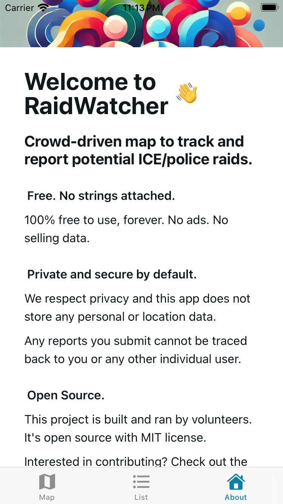
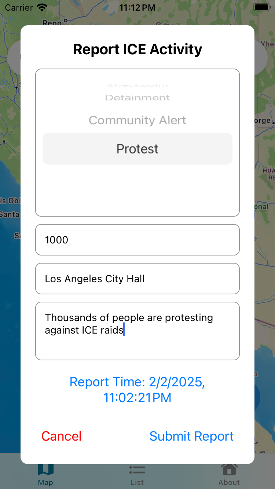
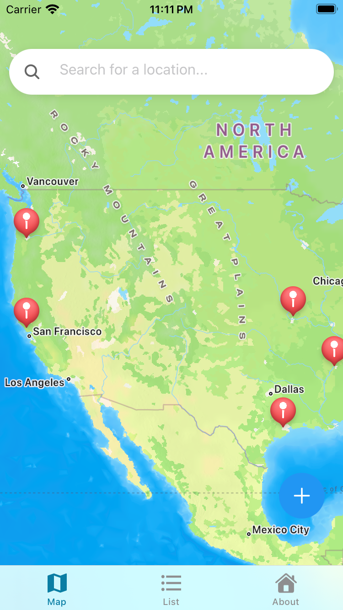

# RaidWatcher 🗺️

RaidWatcher is a crowd-sourced map (ios/android) to track and map reported ICE/police activity.

<table>
  <tr>
    <td></td>
    <td></td>
    <td></td>
  </tr>
</table>

## Privacy & Security

RaidWatcher is designed with community safety in mind. We do not store any identity or location data. There are no user accounts.

## Key points

- Has map interface for viewing reported activities
- List view of recent reports
- Community-driven reporting system
- Cross-platform support (iOS & Android)

## Setup & Development

1. Install dependencies

   ```bash
   npm install
   ```

2. Start the development server
   ```bash
   npx expo start
   ```

## Running the App

npm run start

## Contributing

Contributions are welcomed. Contribution guidelines in the works.

## License

MIT License
